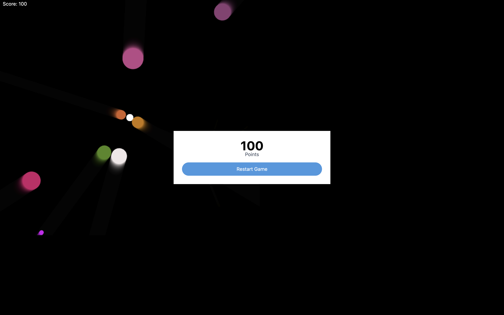

# Jeu JavaScript avec POO

Il s'agit d'un jeu JavaScript simple construit en utilisant les principes de la Programmation Orientée Objet (POO). Le jeu consiste à permettre au joueur de tirer des projectiles sur des ennemis, d'accumuler des points et de gérer les collisions.

## Table des matières

- [Fonctionnalités](#fonctionnalités)
- [Démarrage](#démarrage)
- [Jouabilité](#jouabilité)
- [Technologies Utilisées](#technologies-utilisées)
- [Contributions](#contributions)

## Fonctionnalités

- Le joueur peut se déplacer et tirer des projectiles.
- Les ennemis apparaissent aléatoirement aux bords de l'écran.
- Les collisions entre les projectiles et les ennemis déclenchent des effets de particules.
- Le score du joueur augmente en touchant les ennemis.
- Le jeu se termine lorsque un ennemi entre en collision avec le joueur.

## Démarrage

1. Clonez le dépôt :

- Ouvrez le fichier index.html dans votre navigateur web préféré.
## Jouabilité

- Cliquez avec la souris pour tirer des projectiles sur les ennemis.
- Essayez d'accumuler autant de points que possible.

## Technologies Utilisées

- HTML5 Canvas pour le rendu graphique.
- JavaScript pour la logique du jeu et l'interactivité.
- Bibliothèque GSAP pour les animations.
- CSS pour le style.

## Contributions

Les contributions sont les bienvenues ! N'hésitez pas à ouvrir une issue ou à soumettre une pull request pour des améliorations ou des corrections de bugs.

## Forkez le dépôt.

- Créez votre branche : git checkout -b fonctionnalité/nom_de_votre_fonctionnalité.
- Faites vos modifications : git commit -am 'Ajouter une fonctionnalité'.
- Poussez vers la branche : git push origin fonctionnalité/nom_de_votre_fonctionnalité.
- Ouvrez une pull request.